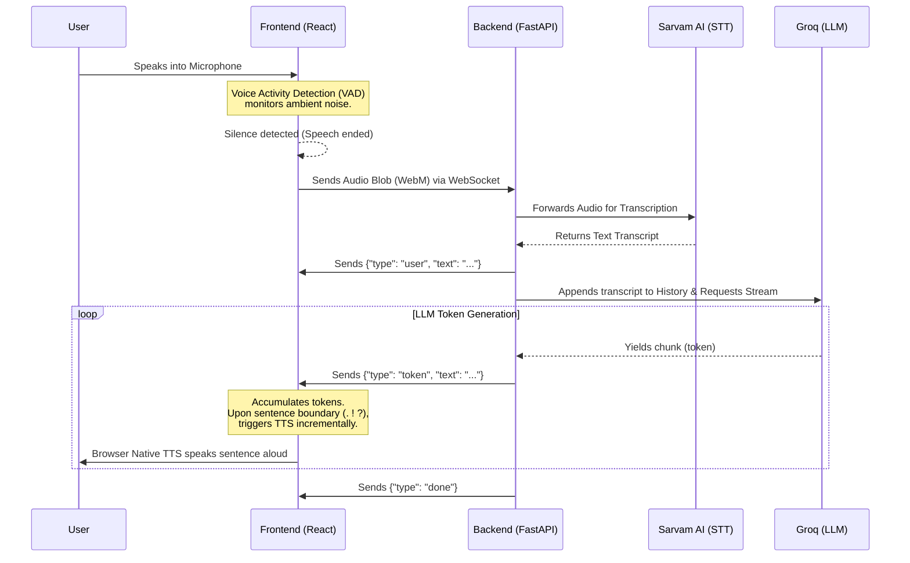

# Medical AI Voice Agent

A real-time, multilingual healthcare voice assistant capable of dynamic conversations, appointment scheduling, and answering medical queries. This project is engineered for ultra-low latency (< 450ms) and utilizes a modern glassmorphic web interface.

## 🚀 Architecture

The application is split into a React frontend and a FastAPI backend communicating entirely over WebSockets to maintain a persistent, bidirectional, low-latency connection.

### Architecture Diagram



## 🧠 Implementation Details

### 1. Frontend (React + Vite)
- **Voice Activity Detection (VAD):** The frontend implements a custom Web Audio API-based VAD inside `useAudioRecorder.ts`. It continuously monitors microphone frequencies. Once the user stops speaking (silence detected), the audio chunk is instantly packaged as a WebM blob and sent to the backend. This prevents the "push-to-talk" bottleneck.
- **Incremental Text-to-Speech (TTS):** To achieve sub-450ms latency, the frontend does *not* wait for the LLM to finish generating the entire response. As JSON tokens stream in from the WebSocket, a regex buffer watches for sentence boundaries (e.g., `.` or `?`). Once a sentence completes, `window.speechSynthesis` instantly reads it aloud while the rest of the response is still generating.
- **UI/UX:** Built with a premium, emoji-free glassmorphic design utilizing CSS variables, micro-animations (pulsing recording indicator), and SVG icons from `lucide-react`.

### 2. Backend (FastAPI + WebSockets)
- **WebSockets:** Uses FastAPI `WebSocket` endpoints (`main.py`) to maintain a live connection, drastically reducing HTTP overhead.
- **Sarvam AI (Speech-to-Text):** The audio blob is forwarded to Sarvam AI (`stt.py`). The transcript is sanitized with strict length and alphabetical filters to prevent empty "hallucinations" caused by background noise.
- **Groq Llama 3 (LLM):** The backend maintains conversation history and calls the Groq API (`llm.py`) with `stream=True` using the `llama-3.3-70b-versatile` model. The temperature is set to `0.7` for dynamic, empathetic, and human-like interactions.

## 🛠 Setup & Running

### Prerequisites
- Node.js (v18+)
- Python (3.10+)
- API Keys for Sarvam AI and Groq

### Backend
1. Navigate to `backend/`
2. Install dependencies: `pip install -r requirements.txt` (or install FastAPI, Uvicorn, Python-dotenv, Requests, and Groq).
3. Add your keys to `backend/.env`:
   ```env
   SARVAM_API_KEY=your_key
   GROQ_API_KEY=your_key
   ```
4. Run the server:
   ```bash
   uvicorn app.main:app --reload
   ```

### Frontend
1. Navigate to `frontend/`
2. Install dependencies: `npm install`
3. Run the development server:
   ```bash
   npm run dev
   ```
4. Open `http://localhost:5173` in your browser.
